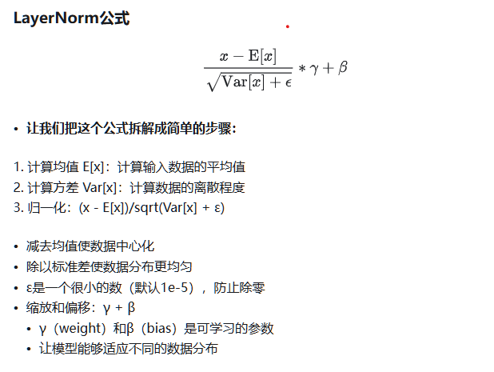

# bert-base的参数配置：
{
  "architectures": [
    "BertForMaskedLM"
  ],
  "attention_probs_dropout_prob": 0.1,
  "directionality": "bidi",
  "hidden_act": "gelu",
  "hidden_dropout_prob": 0.1,
  "hidden_size": 768,
  "initializer_range": 0.02,
  "intermediate_size": 3072,
  "layer_norm_eps": 1e-12,
  "max_position_embeddings": 512,
  "model_type": "bert",
  "num_attention_heads": 12,
  "num_hidden_layers": 12,
  "pad_token_id": 0,
  "pooler_fc_size": 768,
  "pooler_num_attention_heads": 12,
  "pooler_num_fc_layers": 3,
  "pooler_size_per_head": 128,
  "pooler_type": "first_token_transform",
  "type_vocab_size": 2,
  "vocab_size": 21128,
  "return_dict": false,
  "num_labels":18
}

# bert-base 的分层架构
bert 由 embedding层（token embedding，position embedding, segement embedding）、 self-attention、 layerNorm、Feed Forward

# bert-base 计算参数个数要使用的重要参数
从配置中，我们可以知道，最长输入：512  ；词向量的维度是 768维；层数是 12，词向量是 21128个

# 计算参数个数
## embeddin
这里词表大小为 V ，token维度为 W ，则 token_embedding = nn.Embedding(V, W, padding_idx=0) # 本质上是一个 one-hot矩阵的输入X的one-hot表达形式是 1 * V ，那么 参数必然是 V * W ，才能得到  1 * W 的词向量
V*W 为参数个数
position有L个，position_embedding = nn.Embedding(L, W)  L*W
然后是前后句segement_embedding = nn.Embedding(2, W)     2*W
 
此时有 V*W + L*W + 2*W = （V+L+2）* W = (21128 + 512 + 2) * 768 = 21128 * 768 + 512 * 768 + 2 * 768 =  16621056

## self-attention
self-attention:输入X（x,768),  维度是 768 维，12 头，每个是 64维的输出
根据公式： Attention（Q，K,V） = softmax(QK^T/sqrt(d_k)) * V
每一个输入是  （x,64),  则 Q = XW（Q) = （X,64)        K = XW（K) = （X,64)          V = XW（V) = （X,64) 
                      则 QK^T = （X,64) * （64,X) = （X,X)
                      V = （X,64)
根据输入和输出，知道 W(Q) = 768 * 64 , W(K) = 768 * 64 , W(V) = 768 * 64 一共是  12 头，公有三个变量： 768 * 64 * 3 * 12 
最终需要拼接，Z（concat) = （x, 64 * 12） ,那么输出是 （x,768) 需要与X输入保持一致,此时有 参数矩阵  （64*12,768）
总计： (768 * 64) * 3 * 12 + 768* 768  =  2359296

## feed forward
全连接层函数：FFN(x) = max(0, xW1 + b1)W2 + b2
知道默认全连接配置是  4 倍 hidden_size， 4 * 768 = 3072，则 w1 是 （768 ，3072） ， w2是 （3072, 768）
12 *(768 * 3072 + 3072 * 768)  = 56623104

## layerNorm 层归一化
embedding层，加和后会做Layer Normalization， 自注意力层后，会把 embedding + self-attention 层输出做 Layer Normalization；最终全连接层之后，会做 Layer Normalization
归一化公式：

有 γ  和 β 参数，根据输出结构 为 （x,768），知 γ 和 β 的维度和输入的token维度一致，则都是  768
那么有：  embedding(768*2) + self-attention(768*2*12) + feed forward(768*2*12)
总共： 768 * 2 + 768 * 2 * 12 + 768 * 2 * 12 = 38400

## 综上：
16621056 + 2359296 + 56623104 + 38400 = 75641856 
75641856 / 1024 / 1024 = 72.1 MB

# 总结
  "vocab_size": 21128,
   "max_position_embeddings": 512,
   "num_hidden_layers": 12,
   "hidden_size": 768,
大约有 75641856 个，72.1 MB
