- [week2](#week2)
  - [前置概念](#前置概念)
    - [找极小值问题](#找极小值问题)
    - [梯度](#梯度)
  - [深度学习过程](#深度学习过程)
    - [loss函数](#loss函数)
    - [梯度下降法](#梯度下降法)
    - [优化器](#优化器)
- [week4](#week4)
  - [中文分词](#中文分词)
  - [新词发现和tfidf](#新词发现和tfidf)
    - [新词发现](#新词发现)
      - [词的内部应该是稳固的](#词的内部应该是稳固的)
      - [词的外部应该是多变的](#词的外部应该是多变的)
    - [理解文本](#理解文本)
      - [重要词](#重要词)
      - [tfidf](#tfidf)
- [week5](#week5)
  - [向量化](#向量化)
  - [文本向量化](#文本向量化)
    - [one-hot编码](#one-hot编码)
    - [word2vec - 词向量(embedding)](#word2vec---词向量embedding)
      - [训练方式1： 基于语言模型](#训练方式1-基于语言模型)
      - [训练方式2：基于窗口](#训练方式2基于窗口)
        - [cbow模型](#cbow模型)
        - [SkipGram模型](#skipgram模型)
      - [训练方式3：Glove词向量](#训练方式3glove词向量)
      - [词向量训练过程优化](#词向量训练过程优化)
        - [huffman树](#huffman树)
        - [负采样 - negative sampling](#负采样---negative-sampling)
      - [词向量应用 - KMeans](#词向量应用---kmeans)
- [week 6](#week-6)
  - [预训练语言模型](#预训练语言模型)
  - [BERT](#bert)
    - [介绍](#介绍)
      - [最初的BERT进行预训练的方法](#最初的bert进行预训练的方法)
      - [特点](#特点)
      - [应用](#应用)
    - [Embedding层](#embedding层)
    - [模型结构：Transformer模型结构](#模型结构transformer模型结构)
      - [Self-Attention](#self-attention)
        - [Multi-Head](#multi-head)
      - [Add\&Normalize(残差)](#addnormalize残差)
      - [Feed Forward](#feed-forward)
    - [pooler 层](#pooler-层)


# week2
## 前置概念
其他的数学相关前置概念看ppt即可，无需通过笔记理解
### 找极小值问题
深度学习本质上是找最小值的过程。给定一个公式，根据当前的x值获取导数值，导数值大于0，则认为左边更小，导数值小于0则认为右边更小。直到找到一个导数值趋近于0的点
### 梯度
可以理解为多元函数的导数，用于判断下一个更小值该往哪个方向找，意义与导数基本一致。

一元函数：原函数：y=3x<sup>2</sup> &nbsp;导函数：y=6x&nbsp;在x=1处的导数值：6

多元函数：原函数：y=3x<sub>1</sub><sup>2</sup>+4x<sub>2</sub><sup>2</sup>+5x<sub>3</sub><sup>2</sup> &nbsp; 导函数：y={6x<sub>1</sub>, 8x<sub>2</sub>, 10x<sub>3</sub>} &nbsp;在{1，1，1}处的梯度是{6，8，10}.

多元函数求导是分别对x<sub>1</sub>, x<sub>2</sub>, x<sub>3</sub>进行求导，当对x<sub>1</sub>求导时，其余变量看作常数。因此会进行三次偏导计算，得到的导数值为一个三维向量。

## 深度学习过程
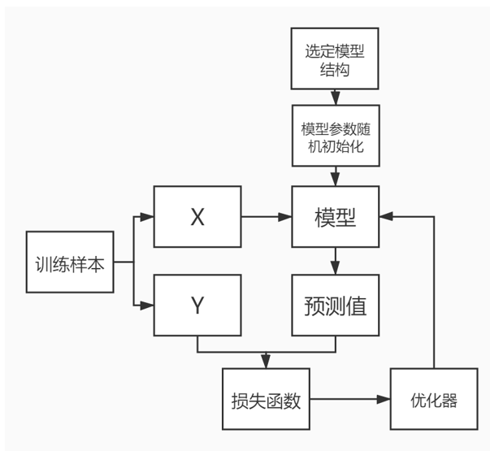

### loss函数
loss函数就是预测值与真实值之间的差值，需要通过找极小值的方式，找到一组模型参数，能让输入x通过模型结构的计算后，得到的loss函数最小。
```
如：模型结构函数为y=wx+b，loss函数结果为y-y',其中y为真实值即为一个固定值，y'为预测值.

则有:
loss函数值=y-y';
loss函数值=y-wx-b;
其中y、x都是固定的训练样本，w和b都是可训练的参数，需要找到y-wx-b的最小值，就需要通过求导的方式进行最小值的查找。
```

### 梯度下降法
本质：根据梯度，更新权重。权重的更新由优化器来做。

### 优化器
当通过计算出梯度后，需要通过优化器确定权重(w,b)移动的大小，下面图中所示的是SGD（Stochastic gradient descent）优化器

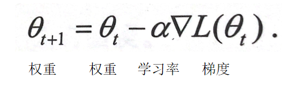

# week4
## 中文分词
看ppt即可，没啥要记录的东西

## 新词发现和tfidf
### 新词发现
词相当于一种固定搭配

#### 词的内部应该是稳固的
如'你好'这个词，'你'与'好'经常会一起出现。
**内部凝固度**。 此值越高，越有可能是一个新词。下图是内部凝固度公式，比如'你好，我是李明'是语料。公式中的分子P(W)是某个词出现的概率，假设'我是'一个新词，那就将'我是'的个数除以语料中所有搭配(假设以两个字作为一个搭配)的总数，P(W)即为计算值。公式中的分母P(C1)...P(Cn)是选取的新词'我是'中的每个字出现的概率乘积，及'我'在语料中出现的概率*'是'在语料中出现的概率。当'我是'这个词出现的概率很高，并且其中单个字出现的概率低，则很容易得出内部凝固度高的结论，及'我是'很有可能是一个新词。

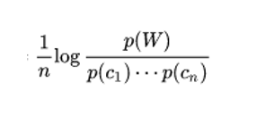


#### 词的外部应该是多变的
**左右熵**。左右熵越高，越有可能是一个新词。一个词的前后应该是不稳定的，及相对随机的。比如'你好，我是李明'是语料。把'我是'假设为新词，那么后面不应该一直是'李明',也有可能是'吉米','鲍勃'等等词，包括'我是'的前面也应该是多变的。下图是左右熵公式，用于计算上述的内容。

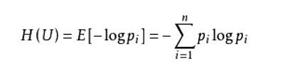

### 理解文本
#### 重要词
假如一个词在某类文本（假设为A类）中出现次数很多，而在其他类别文本（非A类）出现很少，那么这个词是A类文本的重要词（高权重词）。

反之，如果一个词在出现在很多领域，则其对于任意类别的重要性都很差。

#### tfidf
tf：词频。某个词在某类别中出现的次数/该类别词总数

idf：逆文档频率。比如十篇文档，三篇文档出现特定词，那么可以得出来逆文档频率为log(10/3)。 逆文档频率越高，说明特定词越有可能是某类文档中的关键词。

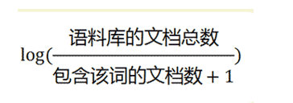

# week5
## 向量化
向量对于机器学习非常重要，大量的算法都需要基于向量来完成

## 文本向量化
1、对于机器来说，字符是没有含义的，只是有区别

2、只是用字符无法去刻画字与字，词与词，文本与文本之间的关系

3、文本转换为向量可以更好的刻画文本之间的关系

4、向量化后，可以启用大量的机器学习算法，具有很高的价值

5、文本是由词和字组成的，想将文本转化为向量，首先要能够把词和字转化为向量

6、所有向量应该由统一维度n，我们可以成这个n维空间是一个语义空间(如下述实例)。
```
我       [0.7 0.8 0.6 0.4]
爱       [0.1 0.6 0.7 0.4]
北京     [0.9 0.5 0.7 0.6]
天安门   [0.7 0.5 0.1 0.4] 
```

### one-hot编码
**实现**：统计一个词表，选出n个字或词，如下所示
```
词表：
词或字  向量
今天    [1, 0, 0, 0, 0]
天气    [0, 1, 0, 0, 0]
真      [0, 0, 1, 0, 0]
不错    [0, 0, 0, 1, 0]
。      [0, 0, 0, 0, 1]

句子就可以表达成以下形式：
今天 不错 -> [1, 0, 0, 1, 0]
今天 真 不错 -> [1, 0, 1, 1, 0]
```
**缺点**：

1、 如果有很多词，编码向量维度会很高，而且向量十分稀疏（大部分位置都是零），计算负担很大（维度灾难）

2、编码向量不能反映字词之间的语义相似性，只能做到区分

### word2vec - 词向量(embedding)
**特点**：向量关系能反映语义关系。

1、词义的相似性反映在向量的相似性上。 如 (你好，您好)之间的相似度是大于(你好，天气)的。

2、向量可以通过数值运算反映词之间的关系。如 国王 -> 男人 = 皇后 -> 女人

3、不管有多少词，向量维度都是固定的

注意：word embedding 和 word vector一般是一样的。非要深究则是word embedding指随机初始化的词向量或字向量，word vector是指训练后的词向量或字向量。

**缺点**：

1、词向量是"静态"的。每个词使用固定向量，没有考虑前后文。

2、存在一词多义的情况。 西瓜 - 苹果 - 华为

3、影响效果的因素非常多。 维度选择、随机初始化、分词质量、词频截断等等

4、没有好的直接评价指标。常需要用下游任务来评价

**应用**：

1、寻找近义词或反义词。词向量只是找词的相关性。具体是近义词还是反义词需要人工筛选

2、获取句向量或文本向量。将句子或文本分成若干个词，找到每个词对应的向量，将所有的词向量通过各种网络模型得到文本向量，就可以使用文本向量计算相似度或聚类等操作

#### 训练方式1： 基于语言模型
可以配合课件中的论文进行对比。

语言模型的本质是基于当前词预测下一个词。因此这里的实现也是通过当前词，进行分类预测。

比如一个词表有100个词，那么就基于当前词进行预测，预测结果做100分类，分到第几类，下个词就有可能是第几个词

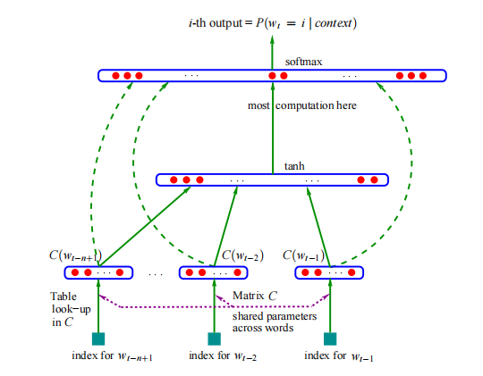


#### 训练方式2：基于窗口
假设：如果两个词在文本中出现时，它的前后出现的词相似，则这两个词语义相似

一般是对文本截取一个窗口，窗口大小为n，及选取n个字，然后用基于这n个字预测n个字中的某个词或字

##### cbow模型
用周围词预测中间词

先对前后的词语做embedding(图中的input环节)，然后再进行pooling(图中的PROJECTION环节)，再对poolling得到的向量进行预测，预测出中间的词。

如"你想明白了吗"，对”明白“这个词进行预测，那么先将”你想“，”了吗“进行embedding，然后过pooling层以后变成一个n维的向量，然后再对这个向量进行分类，与词表中的"明白"进行比较，然后反向传播计算梯度进行训练

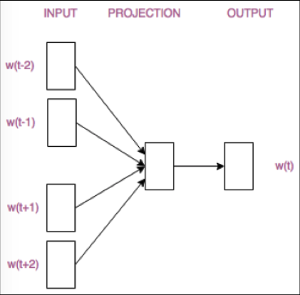

##### SkipGram模型
用中间词预测周围词

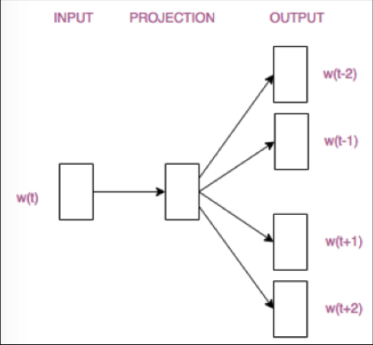

#### 训练方式3：Glove词向量
**共现矩阵**
如下图语料中第一句话"今天" "天气" "不错"这三个词共现了一次，第二句话中"今天" "天气" "很" "好"这四个词共现了一次，依次类推，得到的矩阵就称为共现矩阵

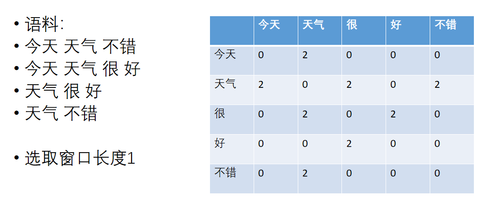

**共现概率**
词i和词j同时出现的次数除以词i出现的次数，被称为词i和词j的共现概率，如P(今天|天气)=2/6=1/3
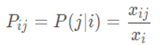

**共现概率比**
本质是两个共现概率的比值，如果 词A与词B的相关性 > 词A与词C的相关性，则共现概率比P(A|B)/P(A|C)会比较高，如果词A与BC的相关性较低或者都很高，则共现概率比会接近1。共现概率比计算：如P(今天|天气)与P(很|好)的共现概率比为P(今天|天气)/P(很|好)=2/3

glove词向量训练的底层逻辑就是输入三个词的词向量，让神经网络学习共现概率比，最后三个词的词向量就会形成一定的相关性

#### 词向量训练过程优化
##### huffman树
对所有词进行二进制编码，使其符合以下特点：

1、不同词编码不同

2、每个词的编码不会变成另一个词编码的前缀。即如果某个词编码为011，则不能有词的编码为011xxx。

原因(需要先看完实现流程，再来看这个原因)：可以有效的降低二分类的次数，再n次的二分类后能够与huffman编码对应上即为预测正确，而不需要做huffman树深度次数的二分类。

3、构造出的词编码总体长度最小，且越高频词编码越短

**实现：**

```
1、获取一个词频表，词与词频对应，如a的词频为50  [[a, 50], [b, 10], [c, 8], [d, 7]]
2、选取词频最低的两个词，将词频更低的放在左侧，另外一个放在右侧，形成一个二叉树，顶点的值记录为二者频率之和
      15
     /  \
    d    c
3、将剩余词中词频最小的，将其与前两个词之和对比，依然是小的放在左边，形成最终的树
         25                                       75
        /   \                                    /  \
       b     15                  =>            25    a
            /  \                              /  \
           d    c                            b    15
                                                 /  \
                                                d    c
4、对huffman树进行huffman编码，将从根节点开始，左侧的子节点记为0，右侧的子节点记为1 则有 a=1, b=00, c=011, d=010
```
对于词向量训练的优化原理：原先可能有n个词就需要做n分类，对于内存的要求很大，以前的机器硬件能力可能做不到。而使用huffman树只需要对深度m进行m次的二分类，大大降低了对于硬件规格的要求。如对c进行预测，则需要3次二分类，第一次二分类的结果为0，第二次结果为1，第三次结果为1；对a进行预测，则只需要一次二分类，二分类为1即为预测正确。

##### 负采样 - negative sampling
不在计算所有词的概率，只挑选某些词计算其概率。如本来的词表可能有1w的维度，经过负采样，每次我就只做10分类，而非1w分类，这10分类中，有一个是预测值，其余均为词表中随机抽取的值。通过减少分类的维度，以降低对于硬件的要求。

#### 词向量应用 - KMeans
**作用：**对文本进行聚类

**实现原理(一个文本向量看作一个点)：**

1、随机选择k个点作为初始质心

2、将每个点派给最接近的质心，以此生成k个组

3、再用这k个组的中心作为新的质心，即对向量做平均操作

反复2、3的操作，直到最后质心的向量不再变化，生成的k个组即分为k类文本


**优点：**
速度很快，可以支持很大量的数据，样本均匀特征明显的情况下，效果不错

**缺点：**

1、需要人为设定聚类数量，可能无法很准确的设置这个数量

2、初始化中心影响效果，导致结果不稳定

3、对于个别特殊样本敏感，会大幅影响聚类中心位置

4、不适合多分类或样本较为离散的数据

**使用技巧：**
1、先设定较多的聚类类别

2、聚类结束后计算类内平均距离

3、排序后，舍弃类内平均距离较长的类别
计算距离时可以尝试欧式距离、余弦距离或其他距离

4、短文本的聚类记得先去重，以及其他预处理

# week 6
## 预训练语言模型

传统训练方法：
设计模型结构 -> 收集/标记训练数据 -> 使用标注数据进行模型预测 -> 真实场景模型预测

预训练方式：
<font color="red">收集海量无标注文本数据 -> 进行模型预训练，并在任务模型中使用</font> -> 设计模型结构 -> 收集/标记训练数据 -> 使用标注数据进行模型预测(在此阶段会设置很小的学习率，如e<sup>-5</sup>) -> 真实场景模型预测

简单理解：预训练就是将权重初始化的更合理而非随机初始化。

## BERT

### 介绍
是什么？ 谷歌最早推出的预训练模型，最早采用预训练思想以及使用Transformer模型结构的预训练模型

#### 最初的BERT进行预训练的方法
1、采用完形填空的思维进行训练(Mask Language Model/Bidirectional Language Model)

按照一定的概率，用[mask]掩盖文本中的某个字或词，再通过训练预测[mask]实际是什么词，训练的时候是根据两边的词进行预测，预测中间的值是什么。类似于基于窗口的词向量训练。

注：现在流行的是基于语言模型的方式进行训练，而非窗口的方式。即根据前n个词预测后一个词的方式

2、句子关系预测(Next Sentence Prediction)

基于前面的句子，预测后面的句子是否合理，以此进行预测。
```
如：
前句：师徒四人历经艰险 后句：取得真经 -> 正样本
前句：师徒四人历经艰险 后句：火烧赤壁 -> 负样本
```

注：此训练方式当前被认为是效果比较差的，基本不怎么用

#### 特点

1、BERT的本质是一种文本表征

2、word2vec是静态的，而BERT是动态的。BERT得到的词会结合语境进行判断，因为词转换成词向量后，还要让文章或句子经过一些网络层，才能得到最后的结果，这个网络层会让结果根据语境进行训练。

#### 应用

BERT适用于任意的NLP任务，一般预训练的模型后面再跟一个线性层，让结果进行n分类就行了。预训练模型+线性层再基于实际任务进行训练，将权重进行微调就能够得到最后的模型

### Embedding层

1、使用[CLS] [SEP]来标记文本起始位置

2、Token Embeddings 词向量。一般提供的矩阵就是词表数量*hidden_size

3、Segment Embeddings 句向量，将文本中的句子进行分隔，一句话一个词向量，如示意图中的"my dog is cute"这句话由一个向量表示。一般提供的矩阵就是设置的最长的句子数量*hidden_size

4、Position Embeddings 词下标向量，用于表示一个词在第几个位置。一般提供的矩阵就是设置的最大下标数*hidden_size

5、将上面三个Embedding向量加和进行Layer Normalization。如"my"最后的向量就是"E<sub>my</sub> + E<sub>A</sub> + E<sub>1</sub>"然后经过Layer Normalization层

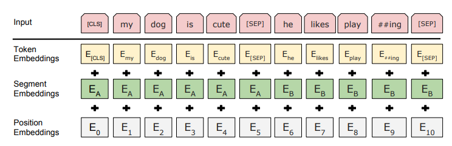

### 模型结构：Transformer模型结构
一般使用的时候可能会叠加多层的Transformer

Transformer流程图(每一层的介绍见下面的小结)：

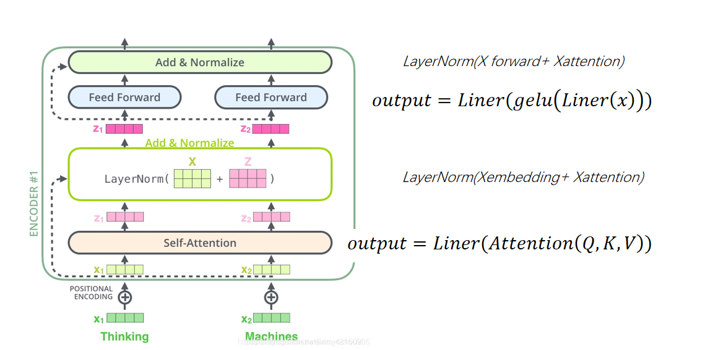
#### Self-Attention
**公式：**

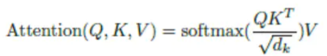


**前置说明：** x为输入，即上一节中文本经过Embedding层得到的矩阵。Q、K、V为x分别与线性层Q、线性层K、线性层V计算得到的矩阵。x的维度为L\*H(L为文本长度或者说分词后的长度，H为隐单元维度)。指定线性层中权重的维度，得到Q、K、V的维度均为L\*H。

**公式解读：**

步骤1：经过多头机制机制，即将线性层Q/K/V矩阵分为n分，以得到Q<sub>0</sub>/K<sub>0</sub>/V<sub>0</sub>, Q<sub>1</sub>/K<sub>1</sub>/V<sub>1</sub>, ... Q<sub>n-1</sub>/K<sub>n-1</sub>/V<sub>n-1</sub>。如L\*H的维度是128\*128，分成8个头，则Q<sub>0</sub>由原来的Q的0-15列切分得到，维度为128\*16，以此类推。

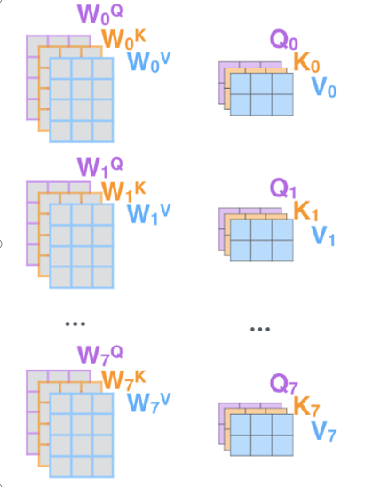

步骤2：QK<sup>T</sup>得到的维度是L\*L，所代表的含义是文本中每个词之间的关系，大致可以理解成下面这张图。即矩阵中每一行都是一个词与其他词的关系向量。再除以$\sqrt{d_k}$(d<sub>k</sub>是隐单元维度/多头切分数量，做这个除法是为了将数值变小，让数值与数值之间的差距减小，以防止指数爆炸的情况，具体可以去搜一下ai)，然后对每一行向量做softmax。得到一个词与其他词的相关性概率。

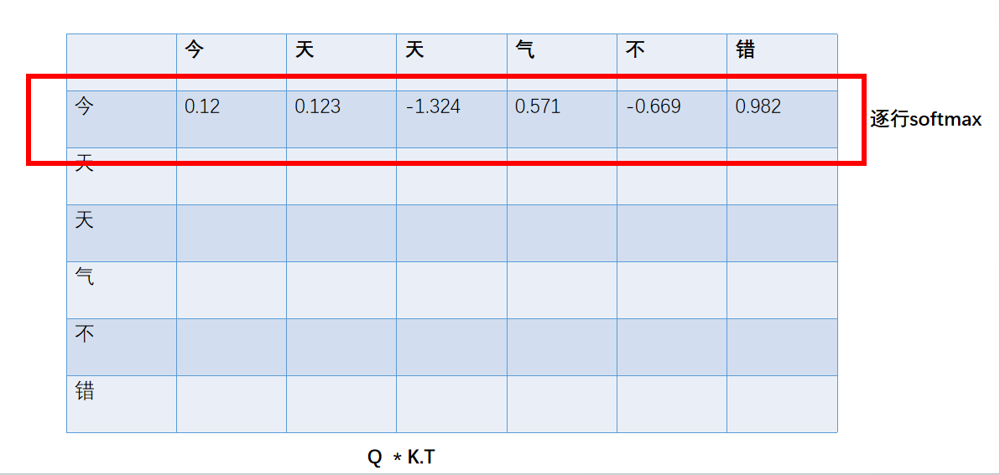

步骤3：再经过softmax的值矩阵乘V，会得到行数为L，列数为H/头数的矩阵，这个矩阵能更好的表示那两个词之间的权重相关性。

循环步骤2、3，次数为步骤1中矩阵分割的数量，计算完 整个矩阵

步骤4：将最后的出来的n个矩阵进行合并。而由于分头可能导致向量内部的数据没那么聚合，需要再经过一个线性层(在Transformer中线性层被称为dense，在pytorch中线性层被称为linear)将向量的内容融合到一个表达空间中，以此得到最后的输出，输出的矩阵仍未维度为L\*H

**与RNN的区别**
从上面不难看出，Self-Attention可以获得任意两个词之间的关联性。而RNN需要从前往后不断的循环计算，与前面的词的关联性会受更早的词的影响，并且距离较远的词与当前的词之间关联性会相对弱一些，因为受到了中间的词的影响。

##### Multi-Head
多头机制本质就是将输入和QKV都分割成n分。做完计算后再拼接的这个过程。
这个机制的作用可以理解为，将词向量分为n份后分别做模型训练，可能其中某一份向量代表这个词的动名词含义，某一份代表了这个词的某些语义等等。

#### Add&Normalize(残差)
公式表示就是LayerNorm(x+z)

残差是使用原始的输入x与上一层的输出矩阵Z做一次矩阵加，以这个加合作为输入，过一遍LayerNorm层。残差的目的是为了保证经过上一层网络后，通过与原始输入相加的方式，保证最后的矩阵与原有输入不偏差太大。

在Transformer中有两处残差，很显然，这两个残差中训练的权重也是分开的，具体残差的位置可以见上面Transformer的流程图

#### Feed Forward
公式：output=Linear(gelu(Linear(x)))

Feed Forward就是一层线性层，一层激活层(gelu)，一层线性层。需要注意的是最内层的linear维度是一个H*I， I是intermediate_size，这个值会比hidden_size大很多用于膨胀矩阵。经过内层的线性层以后，膨胀的非常大，是为了能够表示更多的语义，经过激活层以后，更容易拟合实际情况，降维是为了便于后续的操作。可以进行类比：把原始想法展开写成详细提纲（升维）-> 精炼结构、加润色（非线性激活层）-> 压缩成短小有力的段落（降维）。

外层的Linear维度是I\*H，保证最后的输出维度仍然是L\*H

### pooler 层

在Bert的Embedding层中可以看到，句向量的开头有一个[CLS]。pooler层就是将[CLS]向量看作1*hidden_size的矩阵，然后经过一个线性层和一个激活层。公式如下图。这一层的目的主要是想让[CLS]向量能够表达整句话的意思

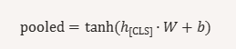