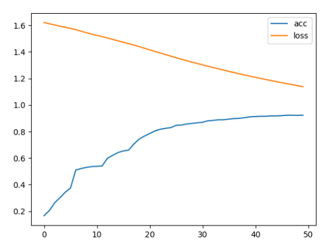
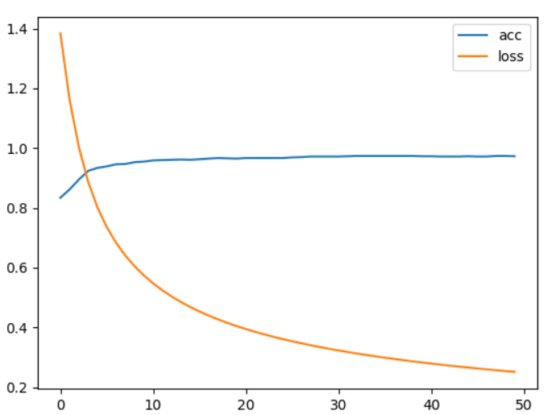

# week 2
## 任务

改用交叉熵实现一个多分类任务，五维随机向量最大的数字在哪维就属于哪一类。

## 文件说明

homeworkNet.py 模型定义

train.py 实现模型训练

predict.py 加载训练模型实现预测

utils 生成训练数据 格式转换函数等

## 网络配置

* 为提高训练精度，使用带隐藏层的两层网络结构，激活函数使用leakyRelu，损失函数使用交叉熵，隐藏层预设维度128维

## 数据生成

随机生成5维向量，根据最大数下标判断生成数据类别

## 训练

迭代次数50次，训练数据1000个，batch size设置为5，Adam优化器，学习率设置0.001。验证集数据量1000个，记录并打印每轮次训练的平均loss以及验证准确率。训练完成后绘制每轮准确率、损失曲线，并存储训练模型。

训练结果记录：

* 单层网络

epoch:49 eval acc:0.923

* 添加隐藏层

epoch:49 eval acc:0.951

## 模型预测

加载模型参数任意生成数据，并打印所属类别、准确率以及预测结果和真实结果可视化对比图。

以下是随机生成10组数据的结果：

org val:tensor([0., 0., 0., 1., 0.]), predict val:tensor([-0.1048,  4.6663, -0.0307, 16.2695, -0.0281]), org class:3, predict class:3
org val:tensor([0., 0., 1., 0., 0.]), predict val:tensor([-0.1070,  9.1681, 12.0752,  1.1267, -0.0528]), org class:2, predict class:2
org val:tensor([0., 0., 0., 1., 0.]), predict val:tensor([ 9.7053, -0.1380,  6.1235,  9.3558, -0.0625]), org class:3, predict class:0
org val:tensor([0., 0., 1., 0., 0.]), predict val:tensor([-6.5144e-02, -3.7938e-02,  1.4678e+01, -1.7398e-03,  2.8823e+00]), org class:2, predict class:2
org val:tensor([0., 1., 0., 0., 0.]), predict val:tensor([ 6.3918e+00,  9.9821e+00, -6.5903e-02, -5.3383e-03, -4.0359e-02]), org class:1, predict class:1
org val:tensor([0., 0., 0., 0., 1.]), predict val:tensor([-0.0990, -0.0219,  6.8173, -0.0299, 14.8173]), org class:4, predict class:4
org val:tensor([1., 0., 0., 0., 0.]), predict val:tensor([ 9.7599,  2.5128,  5.3508, -0.1917,  7.4336]), org class:0, predict class:0
org val:tensor([0., 0., 1., 0., 0.]), predict val:tensor([-0.0240, -0.0729, 10.8626, -0.0603,  9.4035]), org class:2, predict class:2
org val:tensor([0., 0., 1., 0., 0.]), predict val:tensor([ 9.9847, -0.0518, 10.8171, -0.0397, -0.0825]), org class:2, predict class:2
org val:tensor([0., 0., 0., 0., 1.]), predict val:tensor([-0.1259,  3.3918, -0.0682,  8.8646, 13.7220]), org class:4, predict class:4
predict done==input:10 arrays, predict correct:9, predict incorrect:1

其中，第三个数据本是第3类却被识别成第0类
